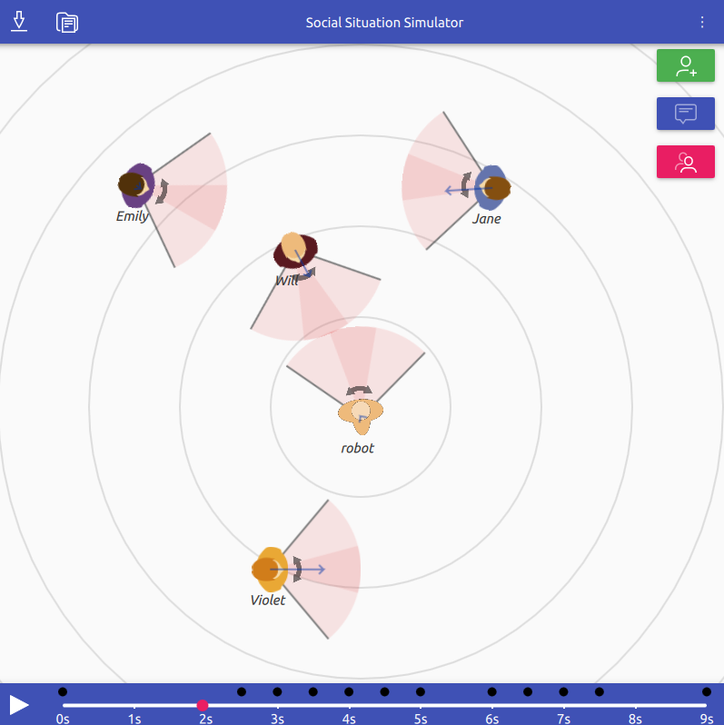

Social Situation Simulator
==========================

A tool to create, visualize, annotate and analyse social situations.

Usage
-----

- Ensure PySide6 is installed (`pip3 install pyside6`)
- `socialsituationsimulator.py`

Analysis
--------

If you export a social situation to a JSON file, you can then post-process it
and analyse it with `analyse.py`.

Check `./analyse.py -h` for the main options.

